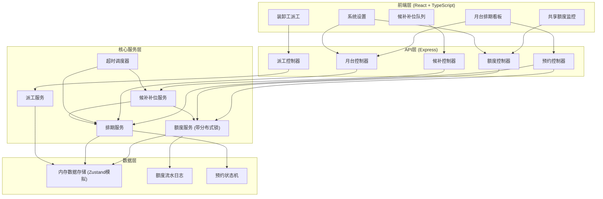
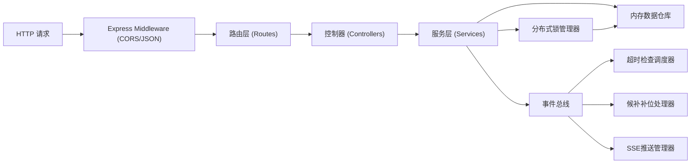
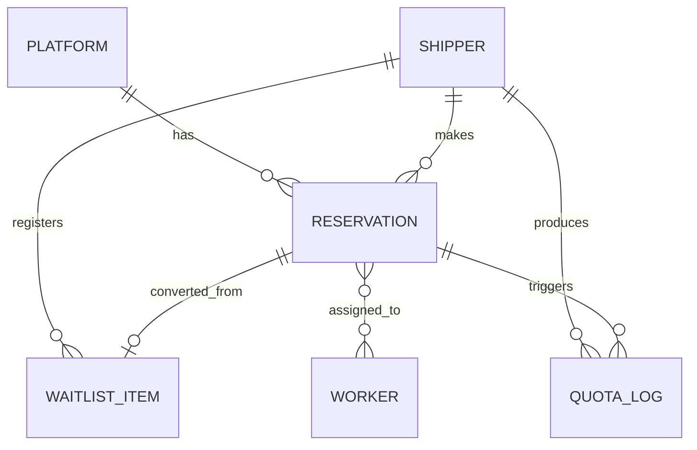

## 1. 架构设计



## 2. 技术描述

- **前端**：React@18 + TypeScript + Vite + TailwindCSS@3 + Zustand + React Router + Lucide React
- **后端**：Express@4 + TypeScript (ESM模式)
- **数据存储**：内存数据（Zustand store 前后端共享数据结构，开发演示用），含并发锁机制模拟
- **初始化工具**：vite-init (react-express-ts模板)
- **实时通信**：轮询模拟 + SSE服务端推送（额度变动、候补通知）

## 3. 路由定义

| 路由 | 用途 |
|------|------|
| / | 月台排期看板（首页） |
| /waitlist | 候补补位队列 |
| /quota | 共享额度池 |
| /dispatch | 装卸工派工 |
| /settings | 系统设置（月台建档、规则配置） |

## 4. API 定义

```typescript
// ===== 基础类型 =====
interface Platform {
  id: string;
  code: string;
  name: string;
  type: 'unload' | 'load' | 'mixed';
  weightLimit: number;
  status: 'active' | 'maintenance';
  createdAt: string;
}

interface Shipper {
  id: string;
  name: string;
  quota: number;
  usedQuota: number;
  frozenQuota: number;
}

interface Reservation {
  id: string;
  platformId: string;
  shipperId: string;
  startTime: string;
  endTime: string;
  vehicleNo: string;
  vehicleType: string;
  cargoType: string;
  cargoWeight: number;
  status: 'pending' | 'confirmed' | 'loading' | 'completed' | 'cancelled' | 'timeout';
  arrivedAt?: string;
  completedAt?: string;
  workerIds?: string[];
  createdAt: string;
}

interface WaitlistItem {
  id: string;
  shipperId: string;
  targetDate: string;
  priority: number;
  vehicleNo: string;
  vehicleType: string;
  cargoType: string;
  status: 'waiting' | 'notified' | 'confirmed' | 'cancelled' | 'converted';
  notifiedAt?: string;
  convertedReservationId?: string;
  createdAt: string;
}

interface Worker {
  id: string;
  name: string;
  group: string;
  status: 'idle' | 'busy' | 'leave';
  todayTasks: number;
}

interface QuotaLog {
  id: string;
  shipperId: string;
  amount: number;
  type: 'deduct' | 'release' | 'freeze' | 'unfreeze';
  reservationId?: string;
  operator: string;
  createdAt: string;
}

// ===== 请求/响应 =====
interface CreateReservationReq {
  platformId: string;
  shipperId: string;
  startTime: string;
  endTime: string;
  vehicleNo: string;
  vehicleType: string;
  cargoType: string;
  cargoWeight: number;
}

interface ApiResponse<T> {
  success: boolean;
  data?: T;
  message?: string;
  errorCode?: string;
}
```

### 接口列表

| 方法 | 路径 | 说明 |
|------|------|------|
| GET | /api/platforms | 获取月台列表 |
| POST | /api/platforms | 新增月台 |
| PUT | /api/platforms/:id | 编辑月台 |
| DELETE | /api/platforms/:id | 删除月台 |
| GET | /api/reservations | 获取预约列表（可按日期/月台过滤） |
| POST | /api/reservations | 创建预约（带并发锁） |
| PUT | /api/reservations/:id/confirm | 车辆到港确认 |
| PUT | /api/reservations/:id/complete | 完成装卸 |
| PUT | /api/reservations/:id/cancel | 取消预约 |
| GET | /api/waitlist | 获取候补队列 |
| POST | /api/waitlist | 登记候补 |
| PUT | /api/waitlist/:id/confirm | 候补确认补位 |
| GET | /api/quota | 获取额度概览和货主配额 |
| PUT | /api/quota/shippers/:id | 更新货主配额 |
| GET | /api/quota/logs | 获取额度流水 |
| GET | /api/workers | 获取装卸工列表 |
| POST | /api/workers | 新增装卸工 |
| PUT | /api/reservations/:id/assign | 指派装卸工 |
| GET | /api/settings | 获取系统设置 |
| PUT | /api/settings | 更新系统设置 |

## 5. 服务端架构图



## 6. 数据模型

### 6.1 ER 图



### 6.2 数据说明

由于使用内存数据存储，在 `shared/` 目录下定义全部数据类型及初始 Mock 数据：

- `platforms`：月台表，预置5条（3卸车+1装车+1混合）
- `shippers`：货主表，预置4家货主，各分配不同额度（总额度100）
- `reservations`：预约表，预置今日8条预约数据，包含各种状态
- `waitlist`：候补队列表，预置3条候补记录
- `workers`：装卸工表，预置8人，分2组
- `quotaLogs`：额度流水表，预置10条历史记录
- `settings`：系统设置单例，超时阈值30分钟、候补确认窗口15分钟

### 6.3 并发控制核心逻辑

```
额度扣减原子性保障（简化版分布式锁）：
1. LockManager维护锁表：Map<lockKey, {ownerId, expiresAt}>
2. 扣减前尝试获取锁：key = `quota:${shipperId}`
3. 锁超时时间：5秒，防止死锁
4. 自旋重试：最多3次，每次间隔100ms
5. 扣减使用Compare-And-Swap模式：
   - 读取当前值 → 校验 → 写入新值（单线程环境下天然原子）
6. 所有额度变更必须写入quotaLogs
```
