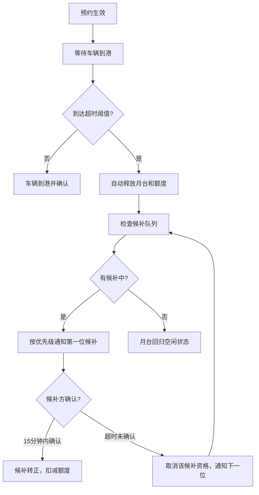
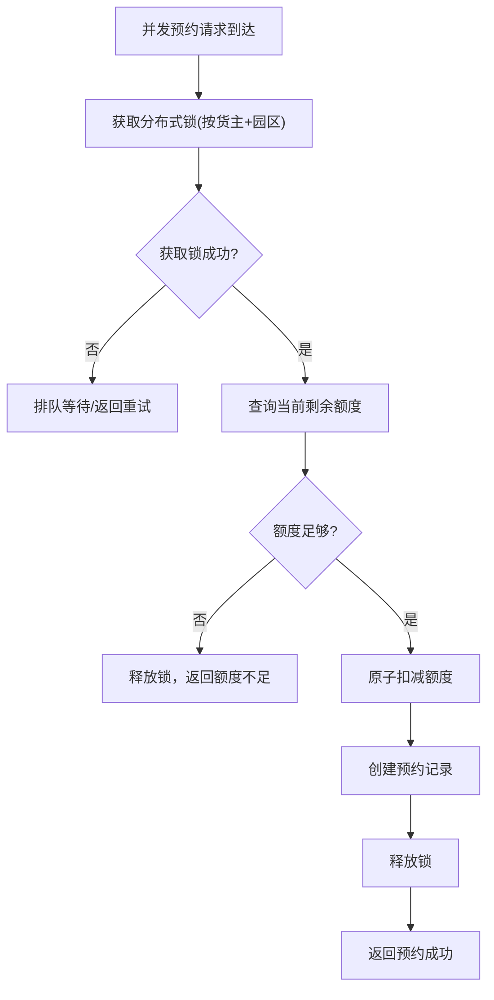

## 1. 产品概述

物流园区卸货月台预约管理系统，解决多家货主并发预约月台时的额度冲突、约满超时未到自动释放、候补补位通知等核心问题，实现园区月台资源高效共享与调度。

- 目标用户：物流园区管理员、货主/承运商调度员、现场装卸主管
- 核心价值：提升月台利用率30%+，消除超额预约冲突，降低车辆等待时间

## 2. 核心功能

### 2.1 用户角色

| 角色 | 注册方式 | 核心权限 |
|------|----------|----------|
| 园区管理员 | 系统预置 | 月台建档、额度配置、全局监控、装卸工派工 |
| 货主调度员 | 管理员创建 | 月台预约、候补登记、查看自有预约记录 |
| 现场主管 | 管理员创建 | 车辆到港确认、装卸进度更新、派工执行 |

### 2.2 功能模块

1. **月台排期看板**：月台总览、时间轴排期、预约状态、实时余量
2. **候补补位队列**：候补登记、优先级排序、自动补位通知、补位历史
3. **共享额度池**：园区总额度配置、货主配额分配、实时余额展示、额度预警
4. **装卸工派工**：装卸工管理、任务指派、派工状态跟踪、工作量统计

### 2.3 页面详情

| 页面名称 | 模块名称 | 功能描述 |
|---------|---------|----------|
| 月台排期看板 | 日历时间轴 | 按日期/时段展示所有月台预约状态，支持拖拽预约 |
| 月台排期看板 | 预约弹窗 | 选择月台、时段、货主、车型、货物类型进行预约 |
| 月台排期看板 | 状态标签 | 待确认/已确认/进行中/已完成/已取消/已超时 |
| 候补补位队列 | 候补列表 | 按优先级展示候补队列，显示预计可补位时间 |
| 候补补位队列 | 候补登记 | 选择目标时段、设置优先级、登记候补车辆信息 |
| 候补补位队列 | 补位通知 | 实时Toast/弹窗通知候补成功，支持一键确认 |
| 共享额度池 | 额度概览 | 园区总额度、已用额度、剩余额度、各货主配额占比 |
| 共享额度池 | 货主配额 | 货主列表、分配额度、已用额度、冻结额度、剩余额度 |
| 共享额度池 | 实时流水 | 额度扣减/释放流水记录，含操作人、时间、关联预约 |
| 装卸工派工 | 装卸工列表 | 姓名、组别、状态（空闲/忙碌/请假）、今日已完成任务 |
| 装卸工派工 | 任务指派 | 将预约单指派给装卸组/个人，设置预计完成时间 |
| 装卸工派工 | 任务看板 | 按人员/组别展示当前任务，支持状态流转 |
| 系统设置 | 月台建档 | 新增/编辑月台：编号、名称、类型（卸车/装车/混合）、承重限制 |
| 系统设置 | 超时规则 | 设置超时未到自动释放时间（默认30分钟）、通知提前量 |
| 系统设置 | 额度策略 | 园区总额度、货主默认配额、预约预扣时长 |

## 3. 核心流程

### 3.1 预约主流程

货主发起预约 → 校验共享额度余额 → 加锁扣减额度 → 创建预约单 → 占用月台时段 → 车辆到港确认 → 装卸工派工 → 装卸作业 → 完成释放月台 → 释放额度

### 3.2 超时释放与候补补位流程

### 3.3 并发额度扣减流程

## 4. 用户界面设计

### 4.1 设计风格

- **主色调**：深海蓝 `#0F2540`（专业、稳重）+ 工业橙 `#FF6B35`（警示、强调）
- **辅助色**：成功绿 `#00B894`、警告黄 `#FDCB6E`、危险红 `#E17055`
- **字体**：显示字体使用 `Space Grotesk`（几何感、工业风），正文字体使用 `Noto Sans SC`
- **按钮风格**：直角硬边、4px圆角、实心按钮带微妙内阴影、hover态微上浮
- **布局风格**：工业仪表盘风格，卡片式分区 + 数据网格，信息密度偏高
- **图标风格**：Lucide线性图标，统一1.5px线宽

### 4.2 页面设计概览

| 页面名称 | 模块名称 | UI元素 |
|---------|---------|--------|
| 月台排期看板 | 顶部导航栏 | 深色背景、Logo、模块切换Tabs、用户信息下拉 |
| 月台排期看板 | 额度摘要条 | 深海蓝渐变背景、大号数字显示总额/已用/剩余、进度条动画 |
| 月台排期看板 | 时间轴主体 | Gantt图风格，Y轴月台列表、X轴时间刻度、色块预约块、hover详情浮层 |
| 候补补位队列 | 优先级卡片 | 橙边高亮第一位候补、倒计时徽章、车辆信息胶囊 |
| 共享额度池 | 环形进度图 | 各货主配额占比环形图，中心显示总额度 |
| 共享额度池 | 实时流水表 | 斑马纹表格、额度变动数字绿色/红色、操作时间戳 |
| 装卸工派工 | 人员卡片网格 | 头像、状态色边框（绿=空闲/红=忙碌/灰=请假）、任务进度条 |

### 4.3 响应式

- 桌面端优先（1280px+），主内容区四栏布局
- 平板端（768-1279px）：两栏布局，候补与额度合并侧栏
- 移动端（<768px）：单栏堆叠，时间轴改为横向滚动
